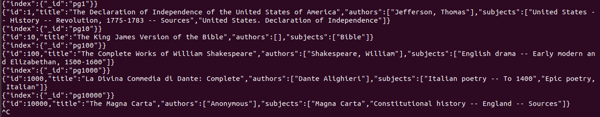

## TUTORIAL SOBRE LO QUE HE APRENDIDO EN ESTA PRÁCTICA 

En esta práctica se ha aprendido a parsear un documento en RDF, un formato de XML, y convertirlo a JSON, un lenguaje de texto que permite visulizar la información de una forma mucho más jerárquica y estructurada que en XML. La herramienta que se ha usado para esta tarea es NODE.js, un framework de Javascript.

Se ha usado la versión de JSON conocidad Limited JSON, una versión que enfatiza mucho más la jerarquía en los datos. 

Una de las librerías de Node.js es Cheerio, que es de gran utilidad para manipular los datos, genera un Document Object Model de fácil manejo y comprensión.

En el proceso para obtener los datos en JSON, se ha aplicado el Behavioral Driven Development, o desarrollo guiado por comportamiento, una metodología de desarrollo que consiste en aplicar tres pasos para desarrollar cada unidad de software en un proyecto:

		-Primero definir un conjunto de pruebas para la unidad
		-Después implementar la unidad
		-Finalmente verificar que la implementación de la unidad haga exitosas las pruebas

Para aplicar el BDD, se han utilizado programas como Mocha y Chai, Mocha es un framework que permite desarrollar las pruebas, provee expresiones como describe, el it, context,beforeEach.

La librería chai es la que se encarga de comprobar la validez de las pruebas, lo que se conoce como la aserción, el expect,equal, exist, pertencen a chai:

En el fichero *package-json* configuramos un script para automatizar una serie de tareas como el testing con Mocha y chai:

	"scripts": {
	    "test":"mocha",
	    "test:watch":"mocha --watch --reporter min",
	    "test:debug": "node --inspect node_modules/mocha/bin/_mocha --watch --no-timeouts"
	  },

  
Se ha hecho uso de la herramienta gulp, para automatizar tareas, como la descarga del fichero fuente en RDF (del proyecto Gutemberg) que posteriormente se iba a parsear, para instalarlo se aplicó el comando:

	npm install gulp@3.9.1

	npm install --save gulp-shell

Estas son las tareas definidas en el gulpfile.js:

	gulp.task("c5-get-guttenberg", shell.task(
	    /* curl option -O, --remote-name
	        Write  output to a local file named like the remote file we get. (Only the file part of the remote file is used, the path
	        is cut off.)
	        The file will be saved in the current working directory. If you want the file saved in a different directory,  make  sure
	        you change the current working directory before invoking curl with this option.
	        The remote file name to use for saving is extracted from the given URL, nothing else, and if it already exists it will be
	        overwritten.
	    */
	    'cd transforming-data-and-testing-continuously-chapter-5/data && ' +
	    'curl -O https://www.gutenberg.org/cache/epub/feeds/rdf-files.tar.bz2 &&' +
	    /*
	    -x      Extract to disk from the archive.  If a file with the same name appears more than once in the archive, each copy will be
	          extracted, with later copies overwriting (replacing) earlier copies.
	    -j      (c mode only) Compress the resulting archive with bzip2(1).  In extract or list modes, this option is ignored.  Note that,
	          unlike other tar implementations, this implementation recognizes bzip2 compression automatically when reading archives.
	    -f file
	            Read the archive from or write the archive to the specified file.  The filename can be - for standard input or standard
	          output.
	    -v      Produce verbose output.  In create and extract modes, tar will list each file name as it is read from or written to the
	         archive.  In list mode, tar will produce output similar to that of ls(1).  Additional -v options will provide additional
	         detail.
	    */
	    'tar -xvjf rdf-files.tar.bz2'
	));

Se ha creado una estructura de directorios, donde se implementó el código para transformar la información:
	
	mkdir databases
	mkdir data

El directorio databases contiene todos los programas y ficheros con código que hemos desarollado para convertir los datos de XML a JSON, las pruebas de BDD.

El directorio data contiene los ficheros de datos fuente, todos los libros del proyecto Gutemberg en formate RDF.

Dentro del directorio databases crearemos dos directorios, uno que se llama test, y que contendrá el fichero *parse-rdf-test.js*, donde implementaremos las pruebas con Mocha. El otro directorio es lib, que contendrá el fichero *parse-rdf*, donde agregaremos los módulos y librerías de xml,  como rdf, para indicarle a cheerio dónde tiene que buscar el código para comprobar si las pruebas funcionan.

Encontrándome en la página 19, este es el código desarrollado en ambos ficheros:

El parse-rdf-test.js

	'use strict';

	const parseRDF = require('../lib/parse-rdf.js');
	const fs = require('fs');
	const expect = require('chai').expect;

	const rdf = fs.readFileSync(`${__dirname}/pg132.rdf`);

	describe('parseRDF',() => {
	        it('should be a function',() => {
	                expect(parseRDF).to.be.a('function');
	        });

	        it('should parse RDF content',() => {
	                const book = parseRDF(rdf);
	                expect(book).to.be.an('object');
	                expect(book).to.have.a.property('id',132);
	                expect(book).to.have.a.property('title','The Art of War');
	                expect(book).to.have.a.property('authors').that.is.an('array').with.lengthOf(2).and.contains('Sunzi, active 6th century B.C.').and.contains('Giles, Lionel');
	                expect(book).to.have.a.property('subjects').that.is.an('array').with.lengthOf(2).and.contains('Military art and science -- Early works to 1800').and.contains('War -- Early works to 1800');

	        });
	});

En este código las apruebas abarcan  cuatro campos que queremos obtener del libro pg132.rdf , que lo que devuelve la función parseRDF sea un objeto, el id,título, autores, y descripción o temas del libro. En la implementación de cada prueba esta falla, luego se corrige, se vuelve a ejecutar y funciona, siguiendo la metodología BDD.

Este es el fichero parse-rdf.js:

'use strict';

const cheerio = require('cheerio');

	module.exports = rdf => {

	        const $ = cheerio.load(rdf);
	        const book = {};

	        book.id = +$('pgterms\\:ebook').attr('rdf:about').replace('ebooks/','');
	        book.title = $('dcterms\\:title').text();
	        book.authors = $('pgterms\\:agent pgterms\\:name').toArray().map(elem => $(elem).text());
	        book.subjects = $('[rdf\\:resource$="/LCSH"]').parent().find('rdf\\:value').toArray().map(elem => $(elem).text());
	        return book;
	};

Aquí se observa que se implementa el código para que la función parseRDF devuelva un objeto (book), se usa el método *load* de cheerio para parsear el contenido del fichero que estamos analizando, el pg132. 

Para cada uno de los campos  del libro que son de interés, se especifica la etiqueta para extraer su información.

Creamos otro fichero *rdf-to-json.js* para analizar otro libro de la base de datos Guttemberg:

	const fs = require('fs');
	const parseRDF = require('./lib/parse-rdf.js');
	const rdf=fs.readFileSync(process.argv[2]);
	const book =parseRDF(rdf);
	console.log(JSON.stringify(book,null,''));

Automatizamos el proceso de convertir de RDF A JSON, para evitar que se demore la ejecución, aplicamos el opción HEAD para imprimir solo las primeras diez líneas, 10 libros.

Primero instalamos node-dir, que facilitará esta tarea con:

	npm install --save --save-exact node-dir@0.1.16

Definimos el fichero rdf-to-bulk.js

	'use strict';

	const dir = require('node-dir');
	const parseRDF = require('./lib/parse-rdf.js');

	const dirname = process.argv[2];

	const options = {
	        match: /\.rdf$/,// Match file names that in '.rdf'.
	        exclude:['pg0.rdf'],
	};

	dir.readFiles(dirname,options,(err,content,next) => {
	        if(err) throw err;
	        const doc = parseRDF(content);
	        console.log(JSON.stringify( {index:{_id: `pg${doc.id}` } }));
	        console.log(JSON.stringify(doc));
	        next();
	});

Ejecutamos:

	node rdf-to-bulk.js ../data/cache/epub/ | head

